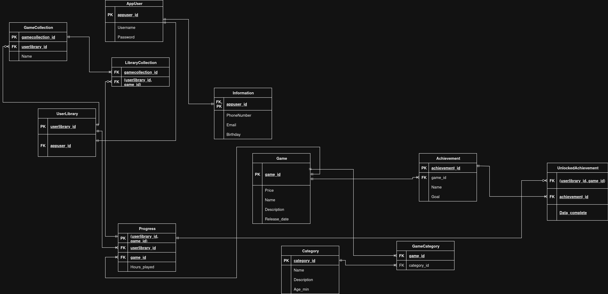

# ЗВІТ З ЛАБОРАТОРНОЇ РОБОТИ №1
## Тема: Збір вимог та створення концептуальної ER-діаграми

### Працювали над лабораторною роботою:
* **Легеза Данііл Павлович IM-41**
* **Бойко Данило Сергійович IM-41**

## Короткий виклад вимог (потреби зацікавлених сторін, дані для зберігання, бізнес-правила)
Для цієї лабораторної роботи, ми обрали розробку бази даних онлайн бібліотеки компьютерних ігр, подібну до Steam || GOG

Зацікавлена сторона: [Легеза Данііл Павлович] – представник ігрової платформи

Аналітик бази даних: [Бойко Данило Сергійович] – збір та документування вимог

## Вимоги до даних та бізнес-правила

### Користувач
+ Система повинна зберігати дані про користувачів, включаючи унікальний логін (Username), пароль для автентифікації(у вигляді хешу) та контактну інформацію (email, номер телефону, дата народження).

+ Кожен користувач має унікальний ідентифікатор.

### Ігри та категорії

+ Система має зберігати ігри, їх назву, ціну на даний момент, опис, та дата релізу.

+ Кожна гра може належати до однієї або декількох категорій

### Бібліотека 

+ Кожен зареєстрований користувач має лише одну особисту бібліотеку ігор.

+ Користувач може додавати ігри до своєї бібліотеки

+ Користувач може створювати власні колекції, з ігр котрі є в бібліотеці. По замовчуванню, всі ігри додаються в загальну колекцію. Одна гра може бути в кількох колекціях одночасно.

### Прогрес та досягнення

- Для кожної гри в бібліотеці користувача система має відстежувати прогрес(Hours_played)

- Кожна гра має певний набір досягнень, з назвою та умовою досягнення

- Система повинна фіксувати, які досягнення були розблоковані користувачем для конкретної гри, та дату, коли це сталося.

## ER-Діаграма (Entity-Relationship Diagram)

## Опис сутностей та зв'язків

### Сутності

#### AppUser
+ **appuser_id (PK):** Унікальний ідентифікатор користувача.
+ **Username:** Унікальне ім'я користувача в системі.
+ **Password:** Хешований пароль для входу.

#### Information
+ **appuser_id (PK, FK):** Ідентифікатор користувача, до якого прив'язана інформація.
+ **PhoneNumber:** Номер телефону.
+ **Email:** Електронна пошта.
+ **Birthday:** Дата народження.

#### UserLibrary
+ **userlibrary_id (PK):** Унікальний ідентифікатор бібліотеки.
+ **appuser_id (FK):** Ідентифікатор власника бібліотеки.

#### GameCollection
+ **gamecollection_id (PK):** Унікальний ідентифікатор колекції.
+ **library_id (FK):** Ідентифікатор бібліотеки, до якої належить колекція.
+ **Name:** Назва колекції (наприклад, "Улюблені").

#### Game
+ **game_id (PK):** Унікальний ідентифікатор гри.
+ **Price:** Ціна гри.
+ **Name:** Назва гри.
+ **Description:** Опис гри.
+ **Release_date:** Дата випуску гри.

#### Category
+ **category_id (PK):** Унікальний ідентифікатор категорії.
+ **Name:** Назва категорії (наприклад, "RPG").
+ **Description:** Опис категорії.

#### Achievement
+ **achievement_id (PK):** Унікальний ідентифікатор досягнення.
+ **game_id (FK):** Ідентифікатор гри, до якої належить досягнення.
+ **Name:** Назва досягнення.
+ **Goal:** Умова для отримання.

#### Progress
+ **(userlibrary_id, game_id) (PK):** Композитний первинний ключ.
+ **userlibrary_id (FK):** Ідентифікатор бібліотеки користувача.
+ **game_id (FK):** Ідентифікатор гри.
+ **Hours_played:** Відстежування кількості годин у грі 

#### LibraryCollection
+ **(gamecollection_id, library_id, game_id) (PK):** Композитний первинний ключ.

#### GameCategory
+ **(game_id, category_id) (PK):** Композитний первинний ключ.

#### UnlockedAchievement
+ **(userlibrary_id, game_id, achievement_id) (PK):** Композитний первинний ключ.
+ **date_complete:** Дата отримання досягнення.

## Припущення та обмеження

+ Унікальність: `Username` та `Email` є унікальними
+ Валюта: Ціна гри (`Price`) зберігається в єдиній валюті.
+ Платіжна інформація: Дані про транзакції винесені за межі цієї моделі.
+ Обмеження на кількість символів в атрибутах, уникальнсть, та подібне, вже буде зроблено в 2 лабораторній работі
