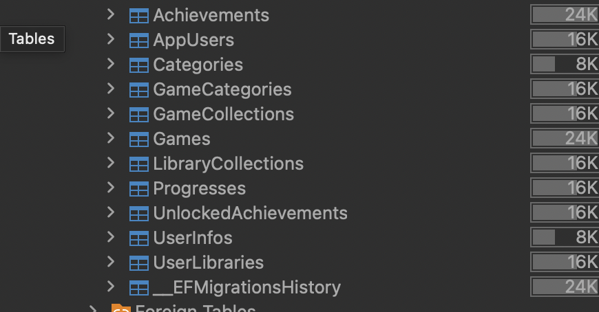
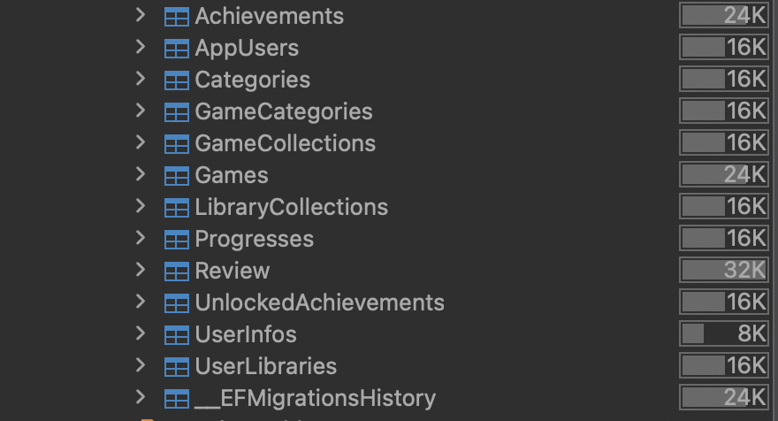
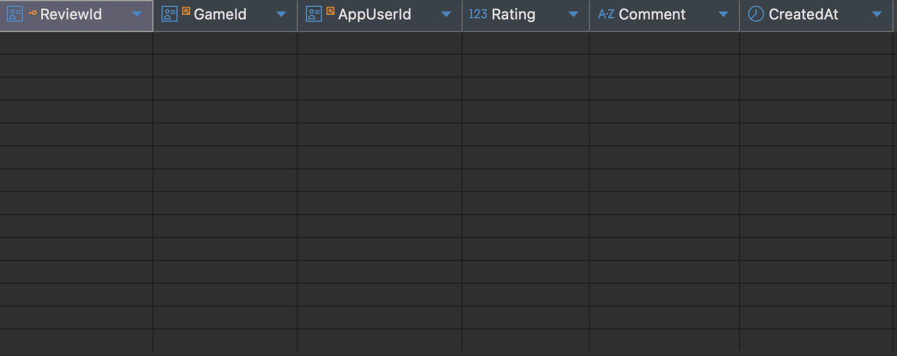
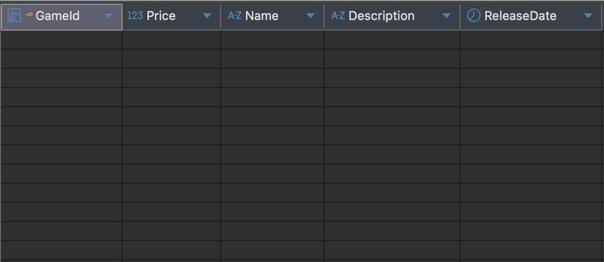
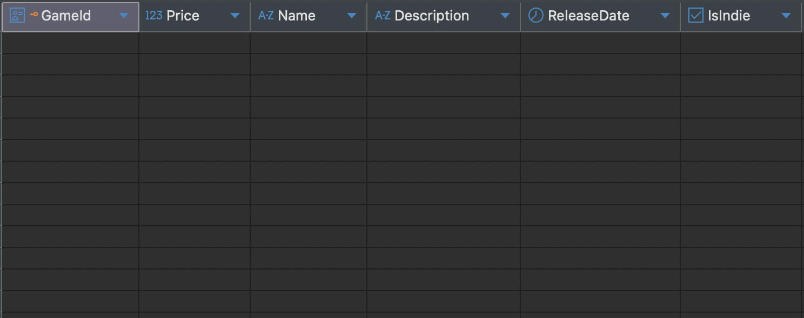
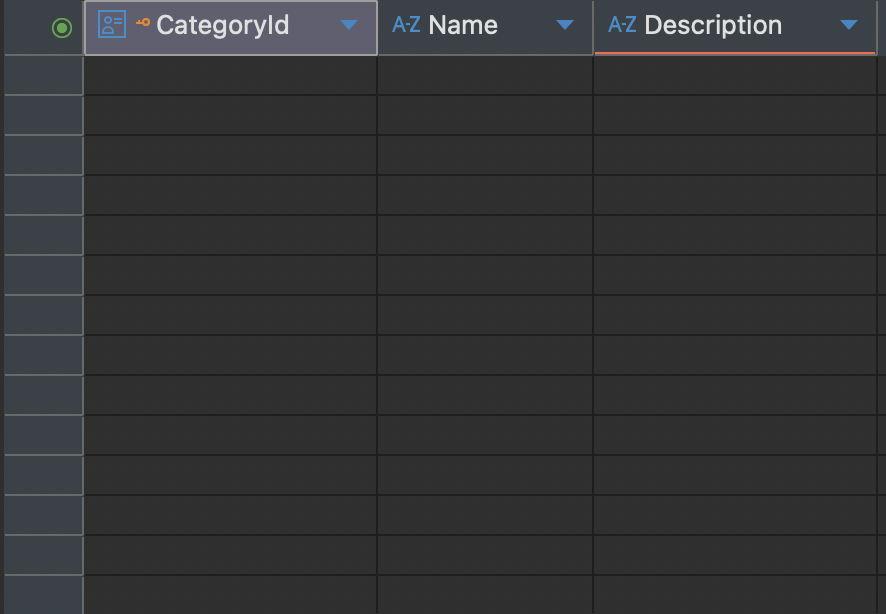
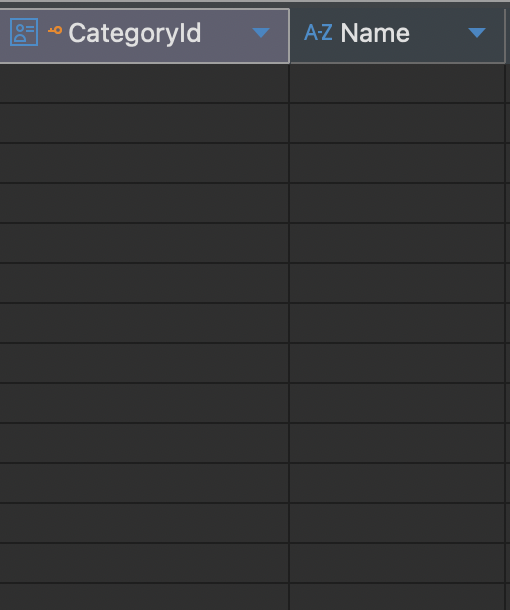

# ЗВІТ З ЛАБОРАТОРНОЇ РОБОТИ №6

## Тема: Міграції

### Працювали над лабораторною роботою:
* **Легеза Данііл Павлович IM-41**
* **Бойко Данило Сергійович IM-41**

## Дані (над якими будемо проводити операції)

### appuser
```csharp
namespace Steam.Models;

public class AppUser
{
public Guid AppUserId { get; set; }
public string Username { get; set; } = null!;
public string Password { get; set; } = null!;

public UserInfo? UserInfo { get; set; }
public UserLibrary? UserLibrary { get; set; }
}
```
### userinfo
```csharp
namespace Steam.Models;

public class UserInfo
{
    public Guid AppUserId { get; set; }
    public string? PhoneNumber { get; set; }
    public string? Email { get; set; }
    public DateTime Birthday { get; set; }

    public AppUser AppUser { get; set; } = null!;
}
```
### userlibrary
```csharp
namespace Steam.Models;

public class UserLibrary
{
    public Guid UserLibraryId { get; set; }
    public Guid AppUserId { get; set; }

    public AppUser AppUser { get; set; } = null!;
    public ICollection<GameCollection> GameCollections { get; set; } = new List<GameCollection>();
    public ICollection<Progress> Progresses { get; set; } = new List<Progress>();
    public ICollection<UnlockedAchievement> UnlockedAchievements { get; set; } = new List<UnlockedAchievement>();
}
```

### librarycollection
```csharp
namespace Steam.Models;

public class LibraryCollection
{
    public Guid GameCollectionId { get; set; }
    public Guid GameId { get; set; }

    public GameCollection GameCollection { get; set; } = null!;
    public Game Game { get; set; } = null!;
}
```
### gamecollection
```csharp
namespace Steam.Models;

public class GameCollection
{
    public Guid GameCollectionId { get; set; }
    public Guid UserLibraryId { get; set; }
    public string Name { get; set; } = null!;
    
    public UserLibrary UserLibrary { get; set; } = null!;
    public ICollection<LibraryCollection> LibraryCollections { get; set; } = new List<LibraryCollection>();
}
```

### game
```csharp
namespace Steam.Models;

public class Game
{
    public Guid GameId { get; set; }
    public decimal Price { get; set; }
    public string Name { get; set; } = null!;
    public string? Description { get; set; }
    public DateTime? ReleaseDate { get; set; }

    public ICollection<Achievement> Achievements { get; set; } = new List<Achievement>();
    public ICollection<GameCategory> GameCategories { get; set; } = new List<GameCategory>();
    public ICollection<LibraryCollection> LibraryCollections { get; set; } = new List<LibraryCollection>();
    public ICollection<Progress> Progresses { get; set; } = new List<Progress>();
}
```

### category
```csharp
namespace Steam.Models;

public class Category
{
    public Guid CategoryId { get; set; }
    public string Name { get; set; } = null!;
    public string? Description { get; set; }
    
    public ICollection<GameCategory> GameCategories { get; set; } = new List<GameCategory>();
}
```

### gamecategory
```csharp
namespace Steam.Models;

public class GameCategory
{
    public Guid GameId { get; set; }
    public Guid CategoryId { get; set; }

    public Game Game { get; set; } = null!;
    public Category Category { get; set; } = null!;
}
```
### progress
```csharp
namespace Steam.Models;

public class Progress
{
    public Guid UserLibraryId { get; set; }
    public Guid GameId { get; set; }
    public int? HoursPlayed { get; set; }

    public UserLibrary UserLibrary { get; set; } = null!;
    public Game Game { get; set; } = null!;
}
```

### achievement
```csharp
namespace Steam.Models;

public class Achievement
{
    public Guid AchievementId { get; set; }
    public Guid GameId { get; set; }
    
    public string Name { get; set; } = null!;
    public string? Goal { get; set; }

    public Game Game { get; set; } = null!;
    public ICollection<UnlockedAchievement> UnlockedAchievements { get; set; } = new List<UnlockedAchievement>();
}
```
### unlockedachievement
```csharp
namespace Steam.Models;

public class UnlockedAchievement
{
    public Guid UserLibraryId { get; set; }
    public Guid AchievementId { get; set; }
    public DateTime? DataComplete { get; set; }

    public UserLibrary UserLibrary { get; set; } = null!;
    public Achievement Achievement { get; set; } = null!;
}
```
# Виконання завдання (migrations)
### 1. Додавання нової таблиці:
```csharp  
namespace Steam.Models;

public class Review
{
    public Guid ReviewId { get; set; }
    public Guid GameId { get; set; }
    public Guid AppUserId { get; set; }
    
    public double Rating { get; set; } 
    public string? Comment { get; set; }
    public DateTime CreatedAt { get; set; }

    public Game Game { get; set; } = null!;
    public AppUser AppUser { get; set; } = null!;
}
```
### Для корректної роботи потрібно зробити логіку one-to-many в AppUser та Game
```csharp
namespace Steam.Models;

public class AppUser
{
    public Guid AppUserId { get; set; }
    public string Username { get; set; } = null!;
    public string Password { get; set; } = null!;

    public UserInfo? UserInfo { get; set; }
    public UserLibrary? UserLibrary { get; set; } 
    public ICollection<Review> Reviews { get; set; } = new List<Review>(); // new
}
```
```csharp
namespace Steam.Models;

public class Game
{
    public Guid GameId { get; set; }
    public decimal Price { get; set; }
    public string Name { get; set; } = null!;
    public string? Description { get; set; }
    public DateTime? ReleaseDate { get; set; }
    public bool IsIndie { get; set; }

    public ICollection<Achievement> Achievements { get; set; } = new List<Achievement>();
    public ICollection<GameCategory> GameCategories { get; set; } = new List<GameCategory>();
    public ICollection<LibraryCollection> LibraryCollections { get; set; } = new List<LibraryCollection>();
    public ICollection<Progress> Progresses { get; set; } = new List<Progress>();
    public ICollection<Review> Reviews { get; set; } = new List<Review>(); // new
}
```
### Також потрібно зробити зміни в DbContext, додаючи правильну логіку моделей
```csharp
   modelBuilder.Entity<Review>()
     .HasKey(x => x.ReviewId);
   
   modelBuilder.Entity<Review>()
       .Property(x => x.Rating)
       .IsRequired()
       .HasAnnotation("CheckConstraint", "Rating >= 0 AND Rating <= 5");
   
   modelBuilder.Entity<Review>()
       .HasOne(x => x.Game)
       .WithMany(x => x.Reviews)
       .HasForeignKey(x => x.GameId)
       .OnDelete(DeleteBehavior.Cascade);

   modelBuilder.Entity<Review>() 
       .HasOne(x => x.AppUser)
       .WithMany(x => x.Reviews)
       .HasForeignKey(x => x.AppUserId)
       .OnDelete(DeleteBehavior.Cascade);
```
### Після виконання міграції, в таблицях (dbeaver) з'явилась нова таблиця
```csharp
dotnet ef migrations add AddReview
dotnet ef database update
```
#### До:

#### Після:




### 2. Додавання нової колонки
#### game
```csharp  
namespace Steam.Models;

public class Game
{
    public Guid GameId { get; set; }
    public decimal Price { get; set; }
    public string Name { get; set; } = null!;
    public string? Description { get; set; }
    public DateTime? ReleaseDate { get; set; }
    public bool IsIndie { get; set; } // new

    public ICollection<Achievement> Achievements { get; set; } = new List<Achievement>();
    public ICollection<GameCategory> GameCategories { get; set; } = new List<GameCategory>();
    public ICollection<LibraryCollection> LibraryCollections { get; set; } = new List<LibraryCollection>();
    public ICollection<Progress> Progresses { get; set; } = new List<Progress>();
    public ICollection<Review> Reviews { get; set; } = new List<Review>();
}
```
#### dbcontext
```csharp
modelBuilder.Entity<Game>()
    .Property(x => x.IsIndie)
    .IsRequired()
    .HasDefaultValue(false);
```
### Результат:
#### До:

#### Після:


### 3. Видалення колонки
#### category
```csharp
namespace Steam.Models;

public class Category
{
    public Guid CategoryId { get; set; }
    public string Name { get; set; } = null!;
    // public string? Description { get; set; }
    public ICollection<GameCategory> GameCategories { get; set; } = new List<GameCategory>();
}
```
#### dbcontext
```csharp
    /* modelBuilder.Entity<Category>()
         .Property(x => x.Description)
            .HasMaxLength(500); */
```
### Результат:
#### До:

#### Після:
